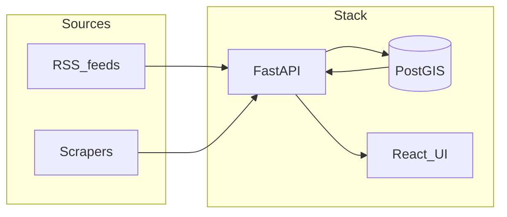

# Puerto Vallarta Intelligence Dashboard

A self-hosted **Banderas Bay “monitor”** stack: aggregate RSS (and pluggable scrapers) into **PostgreSQL + PostGIS**, expose a **FastAPI** backend, and serve a **React + Vite** dashboard with **list + map** views, **weather**, **breaking-style alerts**, and **optional LLM enrichment** (Ollama or Groq).

Use it as a personal or community intelligence surface for news, safety-ish signals, and infrastructure chatter—**not** a replacement for official emergency services.

---

## What’s inside

| Layer | Technology |
|--------|------------|
| API | Python 3.12, **FastAPI**, SQLAlchemy 2, Alembic |
| Database | **PostGIS** 16 (Postgres + spatial extension) |
| Jobs | **APScheduler** (ingest + optional enrichment) |
| Frontend | **React 18**, **Vite**, **TypeScript**, **Leaflet** (map) |
| Deploy | **Docker Compose** (PostGIS + API + nginx static UI) |

---

## Architecture (high level)



1. **Ingest** polls `sources.yaml` (RSS and registered scrapers), dedupes by **URL**, and writes **items**.
2. **Classify** applies keyword heuristics to each headline (category, severity, rough language hint).
3. **Geocode** matches substrings against `neighborhoods.yaml` and may set a **PostGIS point** for the map.
4. **Optional enrichment** calls an LLM to add bilingual summaries and refine tags (if configured).
5. **Alerts** surfaces recent high-signal rows for the ticker and “high alert” styling.

---

## Repository layout

| Path | Purpose |
|------|---------|
| [`docker-compose.yml`](docker-compose.yml) | Services, ports, env wiring |
| [`.env.example`](.env.example) | Copy to `.env` for local or server secrets |
| [`backend/`](backend/) | FastAPI app, Alembic, Dockerfile |
| [`backend/app/`](backend/app/) | Routes, models, ingest, enrichment, alerts |
| [`backend/config/sources.yaml`](backend/config/sources.yaml) | RSS URLs and scraper registry (no code deploy to tweak) |
| [`backend/config/neighborhoods.yaml`](backend/config/neighborhoods.yaml) | Keyword → map coordinates for deterministic placement |
| [`backend/docs/SCRAPERS.md`](backend/docs/SCRAPERS.md) | How to add a site scraper |
| [`backend/alembic/`](backend/alembic/) | Database migrations |
| [`frontend/`](frontend/) | Vite + React UI and production Dockerfile (nginx) |

---

## Prerequisites

- **Docker** with the **Compose plugin** (`docker compose version`).
- For production: a host (VPS) with ports **80/443** (or your chosen HTTP ports) if you reverse-proxy TLS.

---

## Quick start (Docker Compose)

```bash
git clone https://github.com/ProjectBrokenMirror/Intelligence-Dashboard.git
cd Intelligence-Dashboard
cp .env.example .env
# Edit .env — see “Environment variables” below
docker compose build --no-cache
docker compose up -d
```

- **API**: `http://localhost:8000` (OpenAPI: `/docs`)
- **UI**: `http://localhost:5173` (nginx serving the Vite build)

Default DB password in Compose is **`pv`** if you omit `POSTGRES_PASSWORD` (change for anything beyond local dev).

---

## Environment variables

Compose reads a **`.env`** file next to `docker-compose.yml`. Important variables:

| Variable | Purpose |
|----------|---------|
| `POSTGRES_PASSWORD` | Password for DB user `pv`. Must stay consistent with the existing **data volume** after first boot; changing only in `.env` without resetting the volume will break auth. |
| `VITE_API_URL` | **Single** public base URL the **browser** uses to call the API (e.g. `https://api.example.com`). **No trailing slash. No comma-separated lists** (those belong in `CORS_ORIGINS`). Baked in at **frontend image build** time. |
| `CORS_ORIGINS` | Comma-separated **page origins** allowed to call the API (e.g. `https://app.example.com`). Must match scheme/host/port exactly. |
| `OLLAMA_BASE_URL` | Optional. e.g. `http://host.docker.internal:11434` for Ollama on the host. |
| `GROQ_API_KEY` | Optional. Groq OpenAI-compatible API key if not using Ollama. |
| `ENRICHMENT_INTERVAL_MINUTES` | How often the scheduled enrichment job runs (default `60`). |
| `ENRICHMENT_BATCH_SIZE` | Max items per enrichment pass (default `5`). |

After changing **`VITE_API_URL`**, rebuild the frontend:

```bash
docker compose build --no-cache frontend
docker compose up -d
```

The API container runs **`alembic upgrade head`** on startup before Uvicorn.

---

## Docker services and ports (default)

| Service | Image / build | Host ports | Notes |
|---------|----------------|------------|--------|
| `postgres` | `postgis/postgis:16-3.4` | `5432` → 5432 | **Consider removing** host port mapping in production; DB remains reachable on the Docker network as `postgres`. |
| `api` | `backend/Dockerfile` | `8000` → 8000 | FastAPI + scheduler. |
| `frontend` | `frontend/Dockerfile` | `5173` → 80 | Static build + nginx. |

Persistent data: named volume **`pgdata`**.

---

## HTTP API (overview)

Interactive docs: **`GET /docs`** (Swagger UI).

| Method | Path | Description |
|--------|------|-------------|
| GET | `/health` | Liveness |
| GET | `/sources` | Configured sources (from DB, synced from YAML) |
| GET | `/items` | Items; query params: `source_id`, `category`, `severity`, `neighborhood`, `placed_only`, `since`, `limit` |
| GET | `/weather` | Open-Meteo proxy for PV coordinates |
| GET | `/status` | Item/source counts and last fetch time |
| GET | `/alerts` | Breaking list + `high_alert` flag |
| POST | `/ingest/run` | Run ingest immediately |
| POST | `/enrichment/run` | Run one LLM enrichment batch (no-op if no LLM configured) |

Items returned in JSON include optional **`lat`** / **`lng`** derived from PostGIS **`geom`**.

---

## Configuration without redeploying code

### RSS and scrapers — `backend/config/sources.yaml`

- Add or disable feeds (`enabled: true/false`).
- `kind: rss` requires `feed_url`.
- `kind: scraper` requires `scraper_module` matching a key in `SCRAPER_REGISTRY` (see [`backend/app/scrapers/__init__.py`](backend/app/scrapers/__init__.py)).

Mount is read-only in Compose (`./backend/config:/app/config:ro`). Restart the **api** container after edits, or wait for the next scheduled ingest.

### Map placement — `backend/config/neighborhoods.yaml`

Each entry lists **keys** (substrings matched case-insensitively in title + summary), a **slug**, and **lat** / **lng**. Ingest sets **`geom`** when a key matches.

---

## Ingestion and classification

- **RSS**: [`backend/app/ingest/rss.py`](backend/app/ingest/rss.py) uses `feedparser`.
- **Heuristics**: [`backend/app/ingest/classify.py`](backend/app/ingest/classify.py) assigns **category** (`general`, `safety`, `infrastructure`, `event`) and **severity** (`normal`, `elevated`, `high`) from headline text.
- **Deduping**: unique constraint on **`items.url`**.

Scheduled **ingest** interval defaults to **30 minutes** ([`backend/app/config.py`](backend/app/config.py): `ingest_interval_minutes`).

---

## Optional LLM enrichment

If **`OLLAMA_BASE_URL`** or **`GROQ_API_KEY`** is set:

- **Ollama** is tried first (`/api/chat`), then **Groq** (`https://api.groq.com/openai/v1/chat/completions`).
- Bilingual summaries and optional category updates are written to **`summary_en`**, **`summary_es`**, etc., and **`meta.enriched`** is set.
- A **gazetteer** pass can still refine **neighborhood** / **geom** from LLM hints.

Models default to `llama3.2` (Ollama) and `llama-3.1-8b-instant` (Groq); override in settings code if needed.

---

## Alerts and UI

- [`backend/app/alerts/breaking.py`](backend/app/alerts/breaking.py) selects recent items with elevated severity or safety/infrastructure categories for **`GET /alerts`**.
- The React app shows a **ticker** and may apply **high-alert** styling when **`high_alert`** is true.

---

## Reverse proxy and HTTPS (typical VPS)

1. Point DNS **A** records for `app` and `api` subdomains to the server.
2. Run **Caddy**, **Traefik**, or **nginx** on the host to terminate TLS (Let’s Encrypt).
3. Proxy to **`127.0.0.1:5173`** (UI) and **`127.0.0.1:8000`** (API), or adjust to your published ports.
4. Set **`.env`**: `VITE_API_URL=https://api.yourdomain.com`, `CORS_ORIGINS=https://app.yourdomain.com`.
5. **Rebuild the frontend** so the browser bundle calls the HTTPS API URL.

---

## Local development (without Docker for the app)

**Backend** (Python venv recommended):

```bash
cd backend
python -m venv .venv && source .venv/bin/activate
pip install -r requirements.txt
export DATABASE_URL=postgresql+psycopg://pv:pv@localhost:5432/pv_intel
alembic upgrade head
uvicorn app.main:app --reload --host 0.0.0.0 --port 8000
```

Run PostGIS locally or via Compose **only** the `postgres` service.

**Frontend**:

```bash
cd frontend
npm install
npm run dev
```

[`frontend/vite.config.ts`](frontend/vite.config.ts) proxies **`/api`** to `http://127.0.0.1:8000` in dev; leave **`VITE_API_URL`** unset so the client uses `/api` and strips the prefix via the proxy.

---

## Database migrations

- Migrations live under [`backend/alembic/versions/`](backend/alembic/versions/).
- **PostGIS** is enabled in migration `0002` (`CREATE EXTENSION postgis`).

Create a new revision after model changes (from `backend/` with env set):

```bash
alembic revision --autogenerate -m "describe change"
```

Review the generated file before applying.

---

## Troubleshooting

| Symptom | Things to check |
|---------|------------------|
| API crash loop / `password authentication failed` | `POSTGRES_PASSWORD` matches the **initialized** volume, or reset volume (data loss). |
| UI shows “signal timed out” or wrong host in Network tab | **`VITE_API_URL`** wrong or not rebuilt after change; CORS / firewall blocking **api** host. |
| `Failed to parse URL` with a comma | **`VITE_API_URL`** must be a **single** URL; commas belong in **`CORS_ORIGINS`** only. |
| Empty map | Items need a **geom**; add keywords to **`neighborhoods.yaml`** or run **LLM enrich** with good hints. |
| Enrichment does nothing | **`OLLAMA_BASE_URL`** / **`GROQ_API_KEY`** unset or unreachable from the **api** container. |

---

## License and data

Respect each publisher’s **terms**, **`robots.txt`**, and copyright. This tool aggregates links and short excerpts for personal or community use; **compliance is your responsibility**.

---

## Contributing

Improve **`sources.yaml`**, **`neighborhoods.yaml`**, or add scrapers under [`backend/app/scrapers/`](backend/app/scrapers/) following [`backend/docs/SCRAPERS.md`](backend/docs/SCRAPERS.md). Keep changes focused and documented in commit messages.
